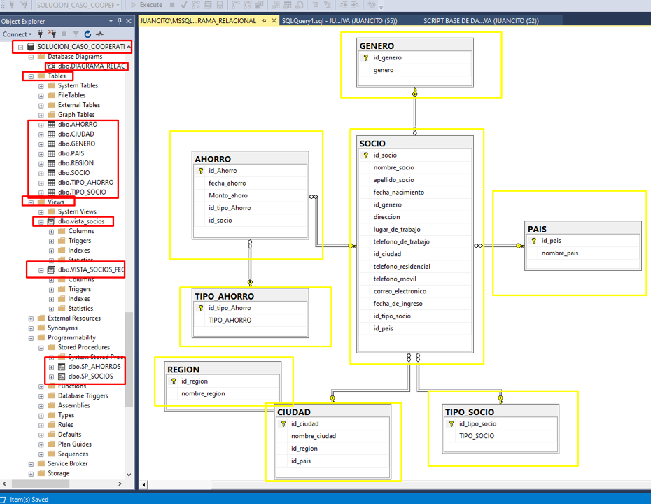

# SOLUCION_CASO_COOPERATIVA
CASO SOLUCION MODELO DE DATOS COOPERATIVA SQL SERVER.

#### Creacion de Modelo de Datos General (Desarrollo y Analisis un Sistema de Base de Datos)

#### Como Personal Profesional en el area de Desarrollo de Sistemas de informacion, te han Solicitado para que realices un levantamiento de informacion en la empresa del modelo manual que estan llevando a cabo en sus ultimos años de operaciones, quieren que le realices un modelo de Base de Dato con unos formularios que tienen o con un Archivo en Excel, y poder tener la informacion mas detallada y mejor organizados por medio un Gestor de base de Datos, como lo es SQL Server, entonces te han entregado esos documentos en los cuales has anotando las entidades, propiedes y/o atributos de sus campos que visualizes, teniendo en cuenta la relaciones y normalizaciones para poder crear tu prototipo fiable, recordar que el modelo tiene dos opciones, la de Desarrollar un Sistema de Informacion y la vez poder Crear un modelo de Analisis de Datos basado en BI para la toma de desiciones.

## -CREACION DE UNA BASE DE DATOS TIPO COOPERATIVA:
## -CREACION DE TABLAS:

### 1-PAIS
### 2-REGION
### 3-CIUDAD
### 4-TIPO_AHORRO
### 5-TIPO_SOCIO
### 6-SOCIO
### 7-GENERO
### 8-AHORRO

### 🎞 CANAL DE YOUTBE:
https://www.youtube.com/channel/UCSob-3E5z4IHtMF5B4bN-FA

## 💚 DALE ME GUSTA, COMENTA Y COMPARTE EL CONTENIDO, ME AYUDAS MUCHOS.
